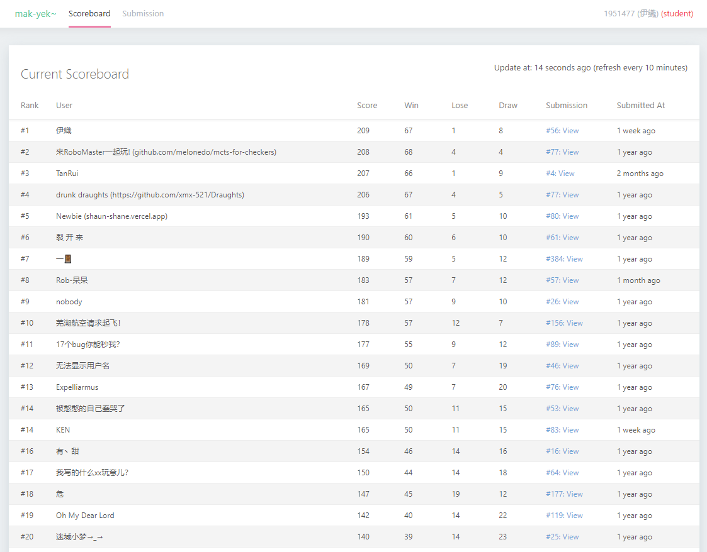

# Draughts AI
## Bonus Project for Tongji SSE 2021 OOP course

- A C/C++ Draughts game AI based on α-β pruning algorithm.
- Final rank:
  - Rank1 with a 67-1-8 record. 
- For project details, please check:  [Project Guide](guide/draughts_project_guide.pdf) and [Iori's Blog](www.moyuiori.link/draughts-ai/).
